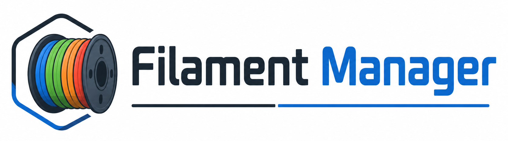

<p align="center">
  
</p>

# Filament Manager für Home Assistant

Filament-Bestandsverwaltung für 3D-Drucker – als eigenständige Integration mit eigenem
Seitenleisten-Panel, ohne YAML-Gefrickel.

- **Übersicht** – Standardansicht mit allen Rollen, Farbpunkt, Restmengen und Summen
- **Verwalten** – Bestand pflegen: Einträge anlegen, OVP-Rollen zählen, Rollen anbrechen,
  Restmengen eintragen, aufgebrauchte Rollen entfernen
- **Admin** – Hersteller, Filament-Sorten und Leergewichte pflegen (nur für HA-Administratoren)
- **Sensoren** – Rollenzahl, Gesamtgewicht, Lagerwert und knapper Bestand für Automationen
- **Services** – Bestand per Automation ändern, z. B. über einen NFC-Tag an der Rolle

Alles zweisprachig (Deutsch / Englisch), folgt automatisch der Sprache und dem Theme von
Home Assistant – inklusive Dark Mode.

---

## Datenmodell

Ein **Eintrag** ist eine Kombination aus Hersteller + Sorte + Farbe. Darin steckt:

| Feld | Bedeutung |
|---|---|
| OVP-Rollen | Anzahl noch verschweißter Rollen, z. B. `3` |
| Angebrochene Rollen | Liste – jede Rolle mit eigener Restmenge |
| Durchmesser | 1,75 / 2,85 / 3,0 mm |
| Filament pro Rolle | Nettogewicht in Gramm, z. B. 1000 g |
| Lagerort, Notizen | Freitext |
| Preis, Kaufdatum | Grundlage für den Lagerwert |
| Düsen-/Betttemperatur | leer = Standard der Filament-Sorte |

**Restmenge:** Prozent und Gramm sind zwei unabhängige Felder. Trage ein, was du weißt –
geschätzte Prozent, gewogene Gramm oder beides. Nichts wird automatisch umgerechnet.

### Leergewichte und Wiegen

Das Gewicht der leeren Spule ist keine Eigenschaft einer Farbe, sondern der **Rollensorte**. Es
lebt deshalb im Admin-Bereich unter **Leergewichte**, mit einer Zeile je Kombination aus
**Hersteller + Sorte + Rollengröße**:

| Kombination | Leergewicht |
|---|---|
| Anycubic PLA · 1000 g | 130,8 g |
| Cailab PLA+ · 250 g | – |

- Eine Zeile **entsteht automatisch**, sobald du einen Eintrag mit dieser Kombination anlegst
- Jeder weitere Eintrag derselben Kombination übernimmt den Wert von selbst
- Die Rollengröße gehört zum Schlüssel, weil eine 250-g-Spule leer weniger wiegt als eine 1-kg-Spule

Ist ein Leergewicht hinterlegt, erscheint bei jeder angebrochenen Rolle im Bereich **Verwalten**
das Feld **Gewogen (g)**. Rolle auf die Waage, Wert eintragen:

```
Rest = Wiegewert − Leergewicht      z. B. 738 g − 218 g = 520 g
```

**Korrigierst du das Leergewicht später, ziehen bereits gewogene Rollen automatisch nach** – der
Wiegewert bleibt gespeichert und wird neu verrechnet (bei 230 g Tara werden aus denselben 738 g
dann 508 g). Eine von Hand eingetragene Restmenge bleibt dabei unangetastet, denn sie kam nicht
von der Waage.

Die Prozentangabe wird nie automatisch verändert. Ohne hinterlegtes Leergewicht ist das Wiegefeld
gesperrt, und ein Wiegewert über den Service wird mit einer Meldung abgelehnt statt still falsch
verrechnet.

Für die Sensoren wird ein Gesamtgewicht gebraucht, dafür gilt diese Reihenfolge:

1. `Restmenge in Gramm`, wenn gesetzt
2. sonst `Restmenge in Prozent × Filament pro Rolle ÷ 100`
3. sonst `0 g`

---

## Installation

### Über HACS (empfohlen)

1. HACS → Dreipunktmenü → **Benutzerdefinierte Repositories**
2. Repository-URL eintragen, Kategorie **Integration**
3. „Filament Manager" herunterladen
4. Home Assistant neu starten

### Manuell

Den Ordner `custom_components/filament_manager` nach `/config/custom_components/` kopieren,
zum Beispiel per Samba:

```bash
robocopy "custom_components\filament_manager" "\\DEIN-HA\config\custom_components\filament_manager" /MIR
```

Danach Home Assistant neu starten.

### Einrichten

**Einstellungen → Geräte & Dienste → Integration hinzufügen → Filament Manager**

Beim ersten Start werden gängige Hersteller (Anycubic, Bambu Lab, Elegoo, eSun, Overture,
Polymaker, Prusament, Sunlu) und Sorten (PLA, PLA+, Silk PLA, Wood PLA, PETG, ABS, ASA, TPU,
PA/Nylon, PC) mit Standardtemperaturen angelegt. Alles davon lässt sich im Admin-Bereich
ändern oder löschen.

In der Seitenleiste erscheint der Eintrag **Filament**.

---

## Optionen

Über **Konfigurieren** an der Integration:

| Option | Standard | Wirkung |
|---|---|---|
| Schwelle für knappen Bestand | `1` | Ein Eintrag gilt als knapp, wenn er höchstens so viele Rollen hat |
| Währung | `EUR` | Einheit des Lagerwert-Sensors |

---

## Sensoren

Alle Sensoren hängen am Gerät „Filament Manager" und aktualisieren sich sofort bei jeder
Änderung – ohne Polling. Die Entitäts-IDs entstehen aus den übersetzten Namen; die genauen
IDs stehen auf der Geräteseite der Integration und lassen sich dort umbenennen.

| Entität | Wert |
|---|---|
| `sensor.filament_manager_rollen_gesamt` | OVP + angebrochen; Attribute `by_material`, `by_manufacturer` |
| `sensor.filament_manager_rollen_ovp` | Summe der OVP-Rollen |
| `sensor.filament_manager_rollen_angebrochen` | Anzahl angebrochener Rollen |
| `sensor.filament_manager_filament_gesamt` | Gesamtgewicht in kg |
| `sensor.filament_manager_eintrage` | Anzahl Einträge (Kombinationen) |
| `sensor.filament_manager_lagerwert` | Preis × Rollen |
| `sensor.filament_manager_knapper_bestand` | Anzahl knapper Einträge; Attribut `items` mit Namen und Restmengen |

### Beispiel: Benachrichtigung bei knappem Bestand

```yaml
automation:
  - alias: Filament wird knapp
    triggers:
      - trigger: numeric_state
        entity_id: sensor.filament_manager_knapper_bestand
        above: 0
    actions:
      - action: notify.mobile_app_handy
        data:
          title: Filament nachbestellen
          message: >-
            {{ state_attr('sensor.filament_manager_knapper_bestand', 'items')
               | map(attribute='name') | join(', ') }}
```

---

## Services

Die `item_id` und `spool_id` stehen in der Ansicht **Verwalten** – ein Klick auf das
graue ID-Feld kopiert die ID in die Zwischenablage.

| Service | Zweck |
|---|---|
| `filament_manager.add_spools` | OVP-Rollen hinzufügen oder abziehen (`count`, auch negativ) |
| `filament_manager.open_spool` | Eine OVP-Rolle anbrechen (startet mit 100 %) |
| `filament_manager.set_remaining` | Restmenge einer angebrochenen Rolle setzen – als Prozent, Gramm oder `gross_weight_g` (Wiegewert) |
| `filament_manager.consume_spool` | Angebrochene Rolle als aufgebraucht entfernen |

Bei `set_remaining` und `consume_spool` kann die `spool_id` weggelassen werden – dann wird
die erste angebrochene Rolle des Eintrags verwendet.

### Beispiel: Restmenge von einer smarten Waage

```yaml
automation:
  - alias: Filamentrolle gewogen
    triggers:
      - trigger: state
        entity_id: sensor.kuechenwaage_gewicht
    actions:
      - action: filament_manager.set_remaining
        data:
          item_id: a1b2c3d4e5f6
          gross_weight_g: "{{ states('sensor.kuechenwaage_gewicht') | float }}"
```

### Beispiel: NFC-Tag an der Rolle

```yaml
automation:
  - alias: Rolle angebrochen
    triggers:
      - trigger: tag
        tag_id: filament-sunlu-petg-schwarz
    actions:
      - action: filament_manager.open_spool
        data:
          item_id: a1b2c3d4e5f6
```

---

## Berechtigungen

Das Panel ist für alle Benutzer sichtbar, aber **nur Administratoren** können etwas ändern.
Nicht-Administratoren sehen die Übersicht und eine schreibgeschützte Verwaltungsliste; der
Admin-Tab wird ausgeblendet. Die Absicherung erfolgt zusätzlich serverseitig – die
schreibenden Websocket-Befehle lehnen Nicht-Administratoren grundsätzlich ab.

---

## Daten und Backup

Alles liegt in einer Datei: `/config/.storage/filament_manager` (Speicherversion 2). Sie ist
Teil jedes Home-Assistant-Backups. Ältere Stände werden beim Start automatisch migriert: ein
Leergewicht, das früher am einzelnen Eintrag hing, wandert dabei in die passende Kombination. Wird die Integration entfernt, bleibt die Datei erhalten – nach
einer Neueinrichtung ist der Bestand wieder da.

---

## Entwicklung

Keine Build-Schritte, keine Abhängigkeiten. Das Panel besteht aus reinen ES-Modulen, die
Home Assistant direkt ausliefert.

```
custom_components/filament_manager/
├── __init__.py          Setup, Panel-Registrierung, Services
├── config_flow.py       Einrichtung und Optionen
├── const.py             Konstanten und Startdaten
├── models.py            Datensätze normalisieren und validieren
├── store.py             Persistenz und CRUD inkl. Löschschutz
├── websocket_api.py     Websocket-Befehle für das Panel
├── sensor.py            Übersichts-Sensoren
└── panel/               Frontend (Vanilla Web Components)
    ├── filament-manager-panel.js   Element, Routing, Ereignisse
    ├── views/                      Übersicht, Verwalten, Admin
    ├── data.js                     Abgeleitete Werte, Filter, Sortierung
    ├── ui.js                       Render-Bausteine und Formatierung
    ├── styles.js                   CSS über HA-Theme-Variablen
    └── i18n.js                     Übersetzungen laden
```

Nach einer Änderung am Panel reicht ein Neuladen der Seite mit geleertem Cache
(`Strg`+`Shift`+`R`); die Modul-URL trägt die Versionsnummer aus `const.py` als
Cache-Buster.

---

## English summary

Filament inventory management for 3D printer owners, as a Home Assistant integration with
its own sidebar panel. Track spools by manufacturer, material, colour and condition (sealed
or opened), keep a count of sealed spools and a separate remaining amount per opened spool.
Master data (manufacturers and filament types) lives in a separate admin area, stock changes
happen in the manage view. Ships overview sensors and services for automations. Fully
bilingual (German / English), theme-aware, no build step.

---

## Lizenz

MIT
